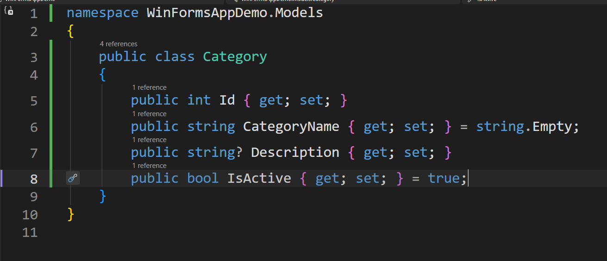
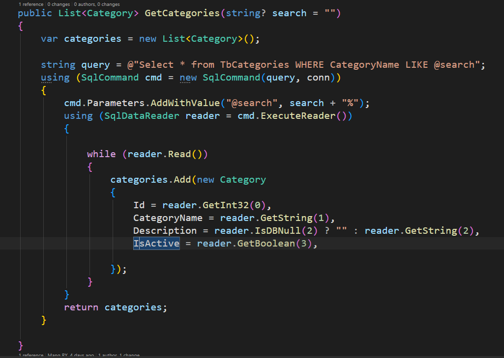
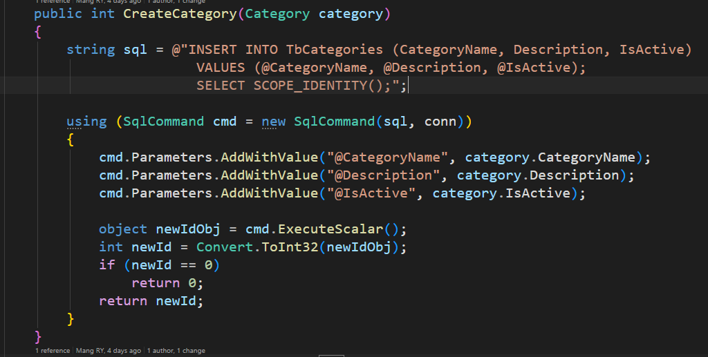
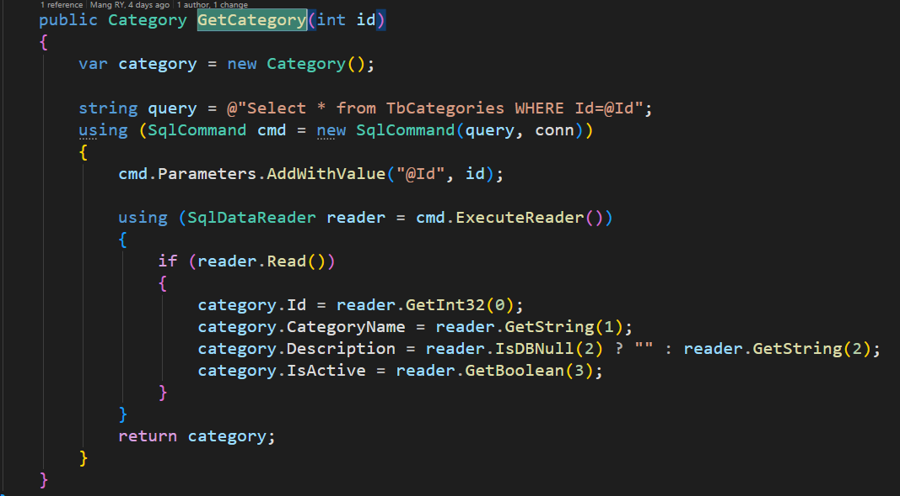
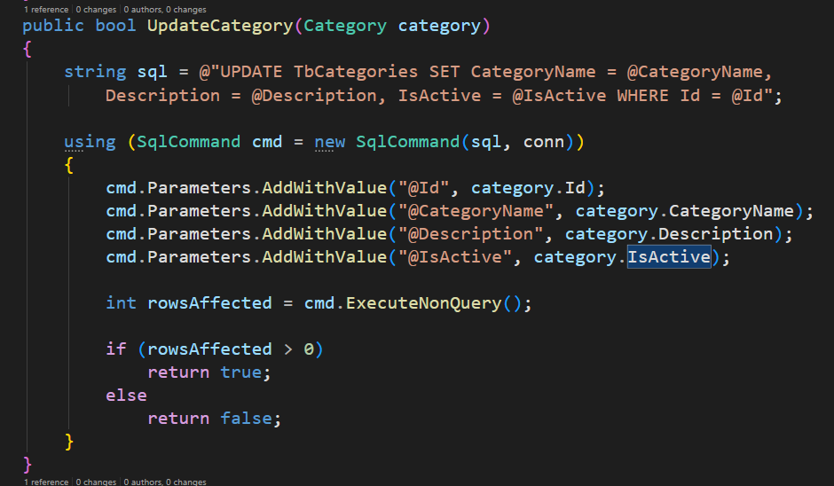
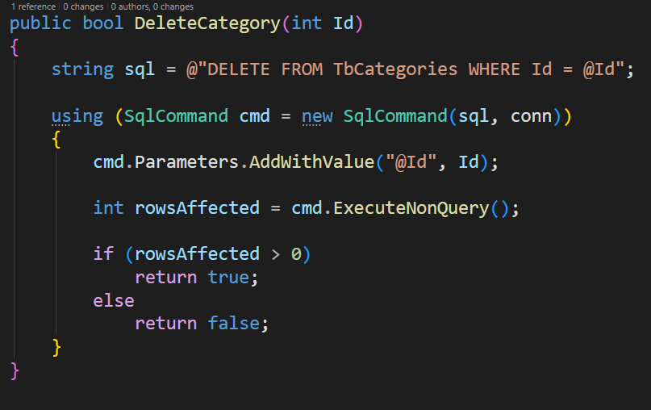
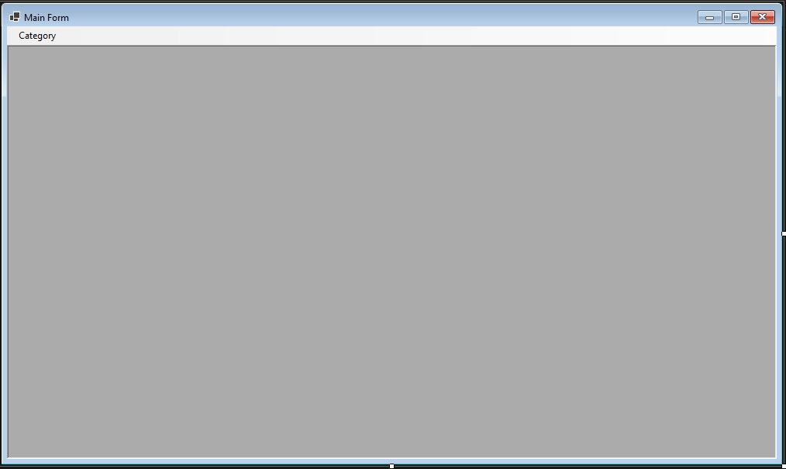
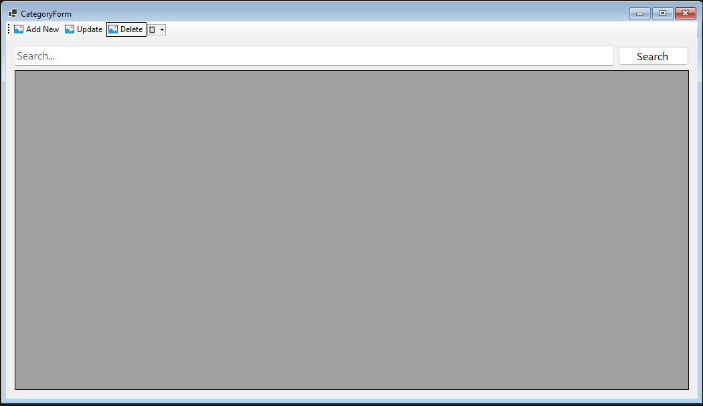
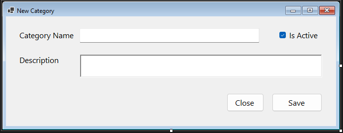
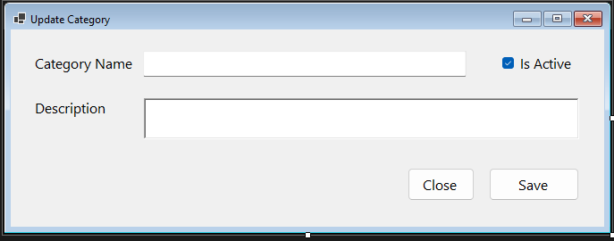

# ADO.NET Sample CRUD Window Forms Guide

មេរៀននេះបង្ហាញជំហានលម្អិតសម្រាប់សិស្ស ដើម្បីបង្កើត Windows Forms CRUD App ដោយប្រើ ADO.NET និង SQL Server លើ Module Category Management។

គោលបំណងបន្ទាប់ពីបញ្ចប់ Lab នេះ៖

1. យល់ពី layered structure (Data, Models, Services, Forms)
2. យល់ពី connection handling តាម ConnectionHelper
3. អាចអនុវត្ត CRUD flow ពី UI ទៅ Database
4. អាចបន្ថែម validation និង error handling មូលដ្ឋាន

---

## 1) Project Name

Create new Windows Forms App project name: WinFormsAppDemo

---

## 2) Project Structure

Structure ដែលណែនាំ:

```text
/Data
    ConnectionHelper.cs
/Forms
    /Lists
        /Categories
            CategoryForm.cs
            CreateCategoryForm.cs
            UpdateCategoryForm.cs
/Models
    Category.cs
/Services
    CategoryService.cs

MainForm.cs
```

ពន្យល់តួនាទី folder នីមួយៗ:

1. Data: class សម្រាប់ database connection
2. Models: class សម្រាប់ data shape
3. Services: business/data access logic
4. Forms: UI layer សម្រាប់ user interaction

---

## 3) Database Setup

Create database name: DemoDB

### Create Table

Create table name: TbCategories

```sql
CREATE TABLE [dbo].[TbCategories] (
    [Id]           INT            IDENTITY (1, 1) NOT NULL,
    [CategoryName] NVARCHAR (100) NOT NULL,
    [Description]  NVARCHAR (200) NULL,
    [IsActive]     BIT            DEFAULT ((1)) NOT NULL,
    PRIMARY KEY CLUSTERED ([Id] ASC)
);
```

Field meaning:

1. Id: Primary Key, auto increase
2. CategoryName: category name (required)
3. Description: optional detail
4. IsActive: active status true/false

---

## 4) Data Layer: Connection Service

Create class in Data folder: ConnectionHelper.cs

reference code image:


សិស្សត្រូវចំណាំ៖

1. Connection string ត្រូវតែត្រឹមត្រូវតាម SQL Server instance
2. ជាទូទៅគេប្រើ using block ពេលបើក connection
3. មិនចាំបាច់ hardcode connection string ច្រើនកន្លែង

---

## 5) Model Layer

Create model class: Category.cs

reference code image:



Model class ត្រូវ map ជាមួយ columns ក្នុង TbCategories:

1. Id
2. CategoryName
3. Description
4. IsActive

---

## 6) Service Layer

Create service class: CategoryService.cs

reference structure image:


Service methods ដែលត្រូវមាន:

1. GetCategories
2. CreateCategory
3. GetCategory
4. UpdateCategory
5. DeleteCategory

### 6.1) GetCategories

reference code:



តួនាទី:

1. Read all categories
2. Support search/filter by keyword
3. Return collection ទៅ DataGridView

### 6.2) CreateCategory

reference code:



តួនាទី:

1. Insert new category
2. Return inserted Id ឬ status

### 6.3) GetCategory

reference code:



តួនាទី:

1. Get single row by Id
2. ប្រើសម្រាប់ Update form load

### 6.4) UpdateCategory

reference code:



តួនាទី:

1. Update selected category by Id
2. Return success status

### 6.5) DeleteCategory

reference code:



តួនាទី:

1. Delete selected row by Id
2. ប្រើ confirm dialog មុន delete

---

## 7) UI Layer

Flow របស់ forms:

1. MainForm: menu entry point
2. CategoryForm: list/search/open dialogs
3. CreateCategoryForm: create dialog
4. UpdateCategoryForm: update dialog

### 7.1) MainForm Design



MainForm code:

```csharp
namespace WinFormsAppDemo
{
    public partial class MainForm : Form
    {
        public MainForm()
        {
            InitializeComponent();
        }

        private void categoryToolStripMenuItem_Click(object sender, EventArgs e)
        {
            CategoryForm form = new CategoryForm();
            form.MdiParent = this;
            form.StartPosition = FormStartPosition.CenterParent;
            form.Show();
        }
    }
}
```

### 7.2) CategoryForm Design and Behavior



CategoryForm responsibilities:

1. Load categories when form opens
2. Bind data to DataGridView
3. Open Create dialog
4. Open Update dialog with selected Id
5. Delete selected category
6. Live search by txtSearch

CategoryForm code:

```csharp
namespace WinFormsAppDemo.Forms.Lists.Categories
{
    public partial class CategoryForm : Form
    {
        private readonly CategoryService categoryService = new CategoryService();
        [DesignerSerializationVisibility(DesignerSerializationVisibility.Hidden)]
        public int Id { get; set; }

        public CategoryForm()
        {
            InitializeComponent();
        }

        private void CategoryForm_Load(object sender, EventArgs e)
        {
            GetCategories();
        }

        protected void GetCategories(string? q = "")
        {
            var cates = categoryService.GetCategories(q);
            dataGridView1.DataSource = cates;
            dataGridView1.AutoGenerateColumns = true;
        }

        private void toolStripButton1_Click(object sender, EventArgs e)
        {
            CreateCategoryForm form = new CreateCategoryForm();
            form.WindowState = FormWindowState.Normal;
            form.StartPosition = FormStartPosition.WindowsDefaultLocation;
            form.ActionStatus = CommandOptions.Create;
            if (form.ShowDialog() == DialogResult.OK)
            {
                GetCategories();
            }
        }

        private void dataGridView1_CellClick(object sender, DataGridViewCellEventArgs e)
        {
            if (dataGridView1.CurrentRow == null) return;

            var category = (Category)dataGridView1.CurrentRow.DataBoundItem!;
            var cate = categoryService.GetCategory(category.Id);
            Id = cate.Id;
        }

        private void toolStripButton2_Click(object sender, EventArgs e)
        {
            UpdateCategoryForm form = new UpdateCategoryForm();
            form.WindowState = FormWindowState.Normal;
            form.StartPosition = FormStartPosition.WindowsDefaultLocation;
            form.Id = Id;
            form.ActionStatus = CommandOptions.Update;
            if (form.ShowDialog() == DialogResult.OK)
            {
                GetCategories();
            }
        }

        private void toolStripButton3_Click(object sender, EventArgs e)
        {
            var delete = MessageBox.Show(
                "Delete category?",
                "Delete",
                MessageBoxButtons.YesNo,
                MessageBoxIcon.Question
            ) == DialogResult.Yes;

            try
            {
                if (delete)
                {
                    var result = categoryService.DeleteCategory(Id);
                    if (result)
                    {
                        GetCategories();
                        MessageBox.Show("Category deleted succeed");
                    }
                }
            }
            catch (Exception ex)
            {
                MessageBox.Show(ex.Message);
            }
        }

        private void txtSearch_TextChanged(object sender, EventArgs e)
        {
            var filter = txtSearch.Text;
            GetCategories(filter);
        }
    }
}
```

### 7.3) CreateCategoryForm



Form responsibilities:

1. Collect input from user
2. Call CreateCategory
3. Return DialogResult.OK when success

```csharp
namespace WinFormsAppDemo.Forms.Lists.Categories
{
    public partial class CreateCategoryForm : Form
    {
        public CreateCategoryForm()
        {
            InitializeComponent();
        }

        public CommandOptions ActionStatus;
        private readonly CategoryService categoryService = new CategoryService();

        private void btnSave_Click(object sender, EventArgs e)
        {
            var category = new Category();
            category.CategoryName = txtCategoryName.Text;
            category.Description = richTextBoxDesc.Text;
            category.IsActive = checkBoxIsActive.Checked;

            try
            {
                var id = categoryService.CreateCategory(category);
                if (id > 0)
                {
                    MessageBox.Show("Category created succeed");
                    DialogResult = DialogResult.OK;
                    Close();
                    return;
                }

                MessageBox.Show("Creating failed");
            }
            catch (Exception ex)
            {
                MessageBox.Show(ex.Message);
            }
        }
    }
}
```

### 7.4) UpdateCategoryForm



Form responsibilities:

1. Load selected data by Id
2. Allow user edit
3. Save by calling UpdateCategory

```csharp
namespace WinFormsAppDemo.Forms.Lists.Categories
{
    public partial class UpdateCategoryForm : Form
    {
        public UpdateCategoryForm()
        {
            InitializeComponent();
        }

        [DesignerSerializationVisibility(DesignerSerializationVisibility.Hidden)]
        public int Id { get; set; }
        public CommandOptions ActionStatus;

        private Category category = new();
        private readonly CategoryService categoryService = new CategoryService();

        private void UpdateCategoryForm_Load(object sender, EventArgs e)
        {
            if (Id > 0)
            {
                category = categoryService.GetCategory(Id);
                txtCategoryName.Text = category.CategoryName;
                richTextBoxDesc.Text = category.Description;
                checkBoxIsActive.Checked = category.IsActive;
            }
        }

        private void btnSave_Click(object sender, EventArgs e)
        {
            category.CategoryName = txtCategoryName.Text;
            category.Description = richTextBoxDesc.Text;
            category.IsActive = checkBoxIsActive.Checked;

            try
            {
                var result = categoryService.UpdateCategory(category);
                if (result)
                {
                    MessageBox.Show("Category updated succeed");
                    DialogResult = DialogResult.OK;
                    Close();
                    return;
                }

                MessageBox.Show("Updating failed");
            }
            catch (Exception ex)
            {
                MessageBox.Show(ex.Message);
            }
        }
    }
}
```

---

## 8) Student Practice Checklist

សិស្សត្រូវសាកល្បង scenario ខាងក្រោម៖

1. Create category ថ្មី 2-3 records
2. Search category ដោយ keyword
3. Select row មួយ ហើយ Update name/description
4. Delete row មួយ ហើយពិនិត្យថាបាត់ពី list
5. បិទហើយបើក app ម្តងទៀត ពិនិត្យ data persistence

---

## 9) Common Errors and Fixes

### Error: Cannot open database requested by the login

1. ពិនិត្យថា database DemoDB មានពិត
2. ពិនិត្យ connection string (server/database/authentication)

### Error: Invalid object name TbCategories

1. ពិនិត្យ table name ត្រឹមត្រូវ
2. ពិនិត្យ schema dbo

### Error: Object reference not set to an instance of an object

1. ពិនិត្យ selected row មុន Update/Delete
2. ពិនិត្យ control names ក្នុង Designer

### Error: Input string was not in a correct format

1. Validate user input មុន parse
2. ប្រើ TryParse សម្រាប់ fields ដែលជាលេខ

---

## 10) Improvement Tasks (Homework)

1. បន្ថែម validation: CategoryName required
2. បន្ថែម clear button នៅ Create/Update form
3. បន្ថែម created date column
4. បំបែក interface (ICategoryService)
5. បម្លែង methods ទៅ async version

---

## 11) Summary

Lab នេះគ្របដណ្តប់ end-to-end CRUD workflow ក្នុង Windows Forms ដោយប្រើ ADO.NET:

1. Database setup
2. Connection helper
3. Model and service logic
4. UI forms and events
5. Testing and troubleshooting

បន្ទាប់ពីយល់ Lab នេះហើយ សិស្សអាចបន្តទៅ Dapper version ឬ architecture កម្រិតខ្ពស់ជាងនេះបានងាយ។
