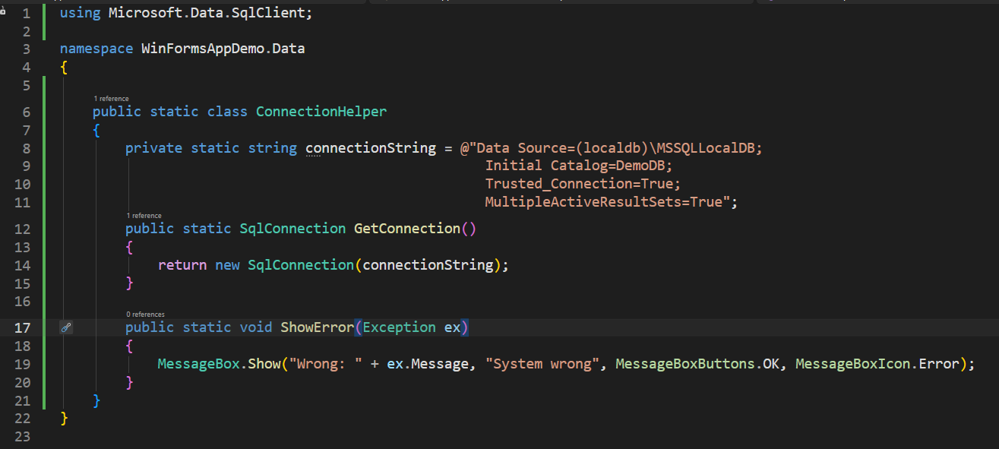
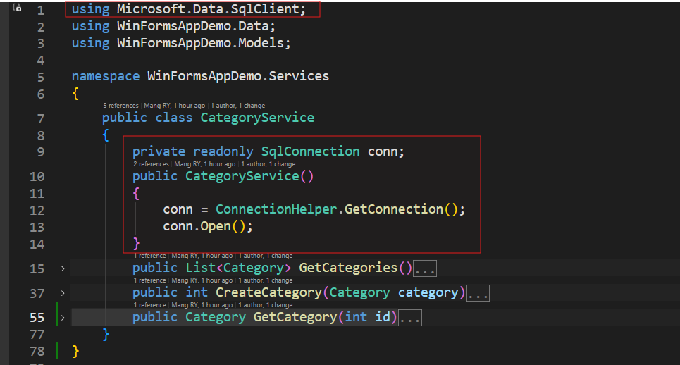

# Sample CRUD Window Form

## Project Name

Create new project Window Form App - `WinFormsAppDemo`

## Project Structure

```
/Data
    ConnectionHelper.cs
/Forms
    /Lists
        /Categories
            CategoryForm.cs
            CreateCategoryForm.cs
            UpdateCategoryForm.cs
/Models
    Category.cs
/Services
    CategoryService.cs

MainForm.cs

```

---

## Database

Create database name - `DemoDB`

### Tables

Create table name - `TbCategories`

```sql

CREATE TABLE [dbo].[TbCategories] (
    [Id]           INT            IDENTITY (1, 1) NOT NULL,
    [CategoryName] NVARCHAR (100) NOT NULL,
    [Description]  NVARCHAR (200) NULL,
    [IsActive]     BIT            DEFAULT ((1)) NOT NULL,
    PRIMARY KEY CLUSTERED ([Id] ASC)
);

```

---


## Connection Service

Create new class in Data folder - `ConnectionHelper.cs`

write code below



---

## Models 

Create new model class - `Category.cs` and write code below


---

## Services

Create service `CategoryService.cs` class inside folder Services


